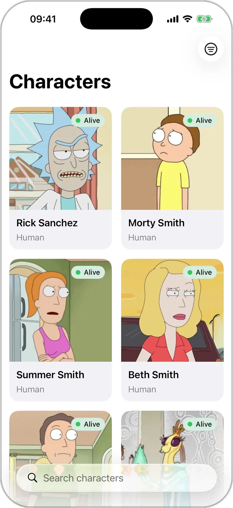
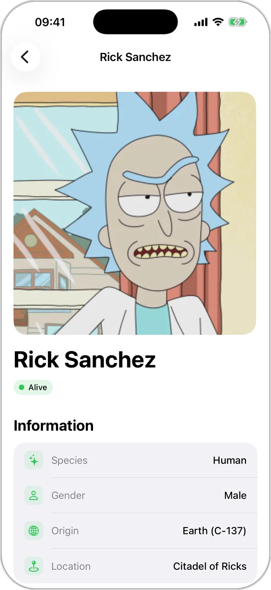
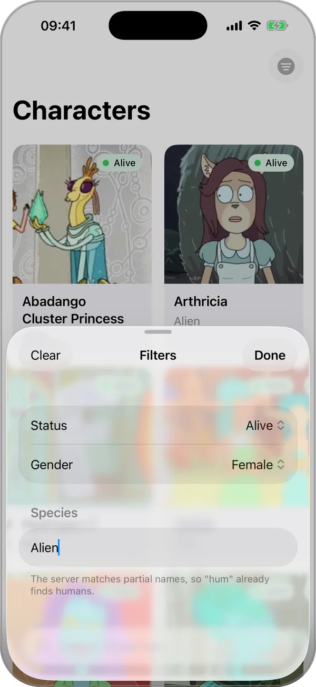
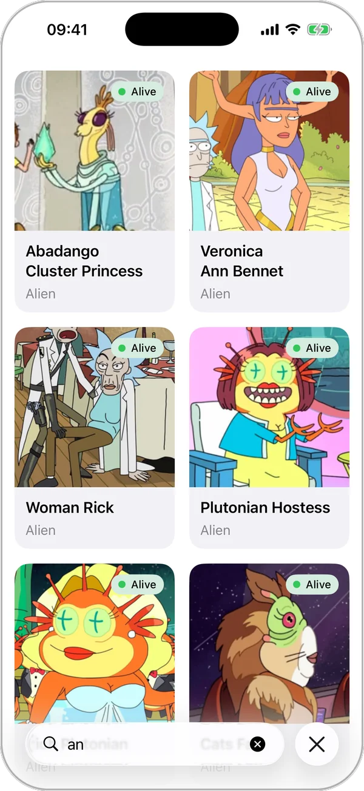
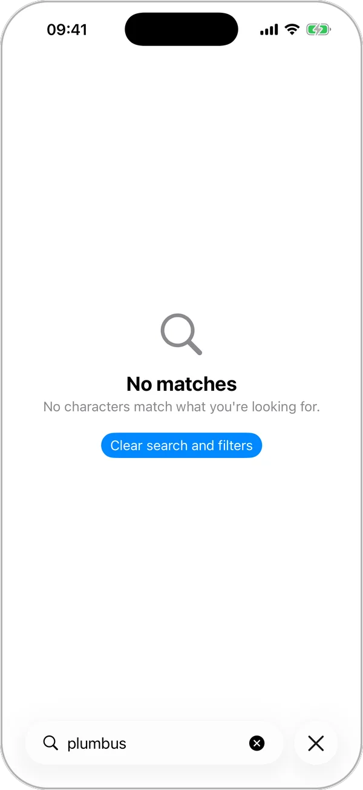
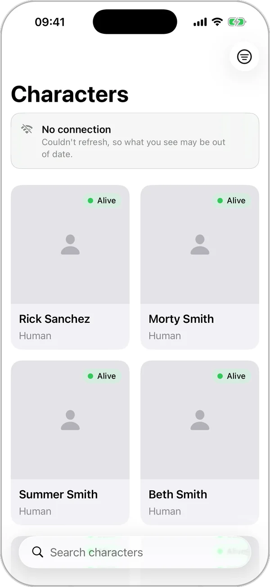

# Rick & Morty

🇬🇧 English · [🇪🇸 Español](README.es.md)

An iOS app for browsing the Rick & Morty universe: a paginated character grid, search
and filters against the server, and a detail screen with the episodes each character
appears in.

<p align="center">
  <picture>
    <source media="(prefers-color-scheme: dark)" srcset="docs/screenshots/list-dark.webp">
    
  </picture>&nbsp;
  <picture>
    <source media="(prefers-color-scheme: dark)" srcset="docs/screenshots/detail-dark.webp">
    
  </picture>&nbsp;
  <picture>
    <source media="(prefers-color-scheme: dark)" srcset="docs/screenshots/filters-dark.webp">
    
  </picture>&nbsp;
  <picture>
    <source media="(prefers-color-scheme: dark)" srcset="docs/screenshots/search-dark.webp">
    
  </picture>&nbsp;
  <picture>
    <source media="(prefers-color-scheme: dark)" srcset="docs/screenshots/empty-dark.webp">
    
  </picture>&nbsp;
  <picture>
    <source media="(prefers-color-scheme: dark)" srcset="docs/screenshots/refresh-failed-dark.webp">
    
  </picture>
</p>
<p align="center"><sub>List · Detail · Filters · Search · Empty · Failed refresh — iPhone 17, iOS 26. Screenshots follow the GitHub theme: dark mode shows the app in dark mode.</sub></p>

SwiftUI + MVVM over a three-layer Clean core, **with zero third-party dependencies**, a
custom two-level image cache, and 212 automated tests.

| | |
|---|---|
| **Minimum** | iOS 18.0 |
| **Swift** | 6.0 (strict mode, no `@unchecked Sendable` anywhere in the project) |
| **Xcode** | 26 |
| **Dependencies** | None |
| **API** | [rickandmortyapi.com](https://rickandmortyapi.com) |

---

## 1. Running it

```bash
open RickAndMorty.xcodeproj
```

Select the `RickAndMorty` scheme and run (`⌘R`). Nothing to install, no `pod install`,
no package resolution.

The full suite, unit and UI:

```bash
xcodebuild test -project RickAndMorty.xcodeproj -scheme RickAndMorty -destination 'platform=iOS Simulator,name=iPhone 17 Pro'
```

SwiftLint runs on every build if installed (`brew install swiftlint`); if it isn't, it
warns and continues, so the project keeps building on a machine that doesn't have it.

---

## 2. What it does

- **Paginated grid** of all 826 characters, with infinite scroll, prefetch eight cells
  before the end, and a pause between pages to avoid tripping the server's rate limit.
- **Server-side search** debounced after the last keystroke, and **filters** by status,
  gender, and species, combinable with each other and with search.
- **Detail screen** with the character's data and its episode list, fetched in a single
  batched request.
- **Complete screen states**: loading skeleton, empty, empty-by-filter, error with
  retry, page error with retry, and an ephemeral notice when a pull-to-refresh fails and
  the list is preserved — each with its own text.
- **Custom image cache**: downsampling during decode, memory and disk tiers,
  deduplicated downloads, and a queue that prioritizes what's on screen.
- **Dynamic Type and contrast**: works up to the largest text size with no clipping (the
  grid drops to a single column, detail and episode rows stack, icons and the status dot
  grow with the text), status shown with color *and* text, text over tinted backgrounds
  hits 4.5:1 contrast, and the app's only two animations respect "reduce motion".
- **One language, cataloged**: every string lives in `Localizable.xcstrings`, none in
  code, and the app ships in English.
- **A custom design system**: spacing, radii, typography, chips, and surfaces come from
  a handful of tokens, and no view writes a style literal (§3).

---

## 3. Architecture

Three layers, with the dependency always pointing inward. Domain doesn't know HTTP
exists; Presentation doesn't know a status code exists.

```
┌──────────────────────────────────────────────────────────────┐
│ Presentation        SwiftUI views + @Observable ViewModels    │
│                     ViewState<T>, error text                  │
└───────────────────────────────┬──────────────────────────────┘
                                │ uses
┌───────────────────────────────▼──────────────────────────────┐
│ Domain              Entities · Use cases · AppError           │
│                     protocol CharacterRepository  ◄───────┐   │
└───────────────────────────────────────────────────────────┼──┘
                                                            │ implements
┌───────────────────────────────────────────────────────────┼──┐
│ Data                Repository · DataSource · Mappers · DTO   │
│                     HTTPClient · Endpoint · ImageCache         │
└──────────────────────────────────────────────────────────────┘
```

The `CharacterRepository` protocol lives in **Domain**, next to whoever uses it, and
**Data** implements it. That inversion is what lets Domain compile without knowing the
network exists, and lets the data source change without touching anything above a
single file.

`AppDependencies` is the only composition root: the one place where the data graph's
concrete types are named. Whatever crosses into the data layer — the repository the
domain uses, the HTTP client the data source uses — is a protocol; the use cases are
structs that wrap that repository and get swapped out underneath, with no protocol of
their own. That's exactly what lets UI tests boot the whole app on an in-memory
repository without any layer noticing.

The one piece that doesn't go through there is the image cache, which travels through
SwiftUI's environment (`@Entry var imageCache`): what size an image needs is a
presentation-layer decision, not the domain's, and putting it in the root would mean
threading it through every intermediate screen's init just to land in the same place.

### A request's path

```
CharacterListView → CharacterListViewModel → FetchCharactersUseCase
   → CharacterRepository (protocol)
   → DefaultCharacterRepository → CharacterRemoteDataSource
   → RetryingHTTPClient → URLSessionHTTPClient → API
   ← Page<Character> ← CharacterMapper ← PageDTO<CharacterDTO>
```

### The design system

`Presentation/DesignSystem/` is the answer to an uncomfortable tally: the app had **six
different radii** for four shapes, **three green opacities** that look identical, and a
screen margin that was 16 in the list and 20 in the detail. None of that looks like a
bug on its own, but together they're what makes an app feel assembled from parts.

It's tokens plus half a dozen components, and fits in one table:

| Token | Values | Governs |
|---|---|---|
| `Theme.Spacing` | 2 · 4 · 8 · 12 · 16 · 24 · 32 | Every gap between two elements |
| `Theme.Radius` | `chip` 10 · `card` 16 · `hero` 20 | Chips, content surfaces, the detail image |
| `Theme.Layout` | Margins, max widths, minimum column widths | What only means something in its own spot |
| `Theme.Tint` | `accent` + a single 12% fill | Chips, icons, badges |
| `Theme.Motion` | `fade`, `notice` | The app's only two animations |
| `Font.*` | `cardTitle`, `label`, `chipCode`… | Aliases over *text styles*, never points |

On top of the tokens sits what used to be copied by hand: `.cardSurface()` (the rounded
background that was duplicated in seven places with two different radii),
`.tintedChip(_:in:)`, `IconTile`, `InfoRow`, `SectionHeader`, and `ErrorStateView` /
`InlineErrorView` — the full-screen error was duplicated word for word between the list
and the detail.

Four rules hold it up:

1. **No view writes a style literal.** If a new number is needed, either a token is
   missing or the literal shouldn't be there.
2. **Text tokens are aliases over *text styles*, never point sizes.** That's the
   condition for Dynamic Type to keep working up to AX5 without touching anything: a
   `.system(size: 17)` stays pinned at 17 even when the user asked for 43.
3. **The scale governs distances between elements; a component's intrinsic sizes live
   with it.** The badge's dot and an icon box's side are their own `@ScaledMetric`,
   because they grow with the text and mean nothing outside their component.
4. **The system doesn't fight the platform.** `Form`, `ContentUnavailableView`, button
   styles, and materials stay as they are; only what the project was already deciding by
   hand gets tokenized, not what iOS already decides well.

What's gained isn't cosmetic: chip contrast stops depending on every screen remembering
to set the text to primary — the chip does it — the "reduce motion" rule goes from being
written in two files to being written once, and the next screen gets assembled from
pieces instead of literals.

---

## 4. Decisions worth explaining

**Typed errors, end to end.** The whole project uses `throws(AppError)` instead of
`throws`. Callers can exhaustively `switch` over what can fail instead of catching an
`any Error` they can only guess at. `URLError`, `DecodingError`, and HTTP status codes
get translated to `AppError` inside the data layer; the only thing that escapes from
there, as data, is the number in a `.server(statusCode:)`, and the only thing decided
with it is whether a 5xx deserves a retry.

**Rate limiting (429) is its own case.** The API sits behind Cloudflare, which answers
429 as soon as it's asked for several pages in a row — exactly what a fast scroll
produces. It's not a server error: the server's fine, we're the ones going too fast.
It's fixed by waiting, not by retrying harder, which is why it gets its own case and its
own wait (seconds instead of milliseconds).

**One shared rate for the whole host (`RateLimiter`).** Cloudflare limits by IP ahead of
its own cache, and avatars and JSON live on the same host: every image and every page
count against the same quota. That's why the rate at which the app goes out to the
network is a single shared piece between the HTTP client and the image cache: a token
bucket (eight per second to start) and, if a 429 still lands, a shared brake that
respects the server's `Retry-After`, halves the rate, and recovers it gradually with
successes. Limiting how many downloads run at once wasn't enough — four small, fast
images are twenty-five requests per second, and that number, not the count of painted
cells, was what earned the penalty and took the next page down with it.

**A state enum instead of three flags.** `ViewState<T>` makes it impossible to type
"loading and failed at once," and turns every view into an exhaustive `switch` the
compiler forces to cover completely.

**A screen failure ≠ a partial failure.** If page 7 fails, the six pages the user is
already looking at are still valid: the error goes at the bottom of the list, not
full-screen. Same on the detail screen, where an episodes failure doesn't take down the
character already on screen.

**Searching is listing with a filter set.** There's no separate
`SearchCharactersUseCase`: the pagination rules are identical, and splitting them would
just duplicate that logic to have another name.

**`CharacterFilter.empty`, not `.none`.** `Optional` already owns a `.none` member, so
with that name a comparison like `filters.last == .none` compiles without complaint and
asks whether the optional is nil, not whether the filter is empty — a test passing green
for the wrong reason. Renaming it is the only thing needed to make that impossible.

**One language, but cataloged.** The app ships in English, and only English, and that's
a decision, not something half-done: the string catalog (`Localizable.xcstrings`, with
Xcode-generated symbols) exists so that **no visible text sits in the code**, not to
translate today. Every key carries a comment saying where it appears and why, down to
the strings that only give width to a redacted skeleton. Adding a language tomorrow is
adding a column to the catalog without touching a single view.

**The failed-refresh notice lasts six seconds.** If a pull-to-refresh fails, the list is
preserved and a notice appears between the title and the grid, saying what happened and
that what's shown might be stale. It goes away on its own, on tap, or sooner if another
refresh brings back data. The view model only exposes the failure and how to dismiss
it; how long it shows and how it enters and exits is the view's call. No queue, because
there's never more than one sender: a second failure while the notice is showing just
keeps the one that's there.

---

## 5. The image cache

This is the part with the most engineering judgment in the project, because a grid of
826 avatars is where a scroll breaks. Three costs, in order of impact:

1. **Decoding.** A 300×300px avatar weighs about 25 KB compressed, but the bitmap that
   comes out of decoding it runs 360 KB, and what weighs on memory is the bitmap. This
   decodes **at cell size**, on the spot, not at paint time: the bitmap is never bigger
   than what's shown, so layout sets the memory ceiling, not whatever the server decides
   to send. At today's 300×300 and cells no smaller than 150pt, the downsampling never
   actually kicks in — ImageIO doesn't upscale — what does matter per cell is forcing
   the decode here, off the main thread, instead of leaving it for paint time, which
   happens during the scroll.
2. **Repeating work.** Scrolling back can't cost another download or another decode:
   memory first, disk second, network as a last resort. The original bytes are saved,
   not the downsampled bitmap, so another size costs a decode, not another download.
3. **Asking for the same thing twice at once.** Normal in a grid, not the exception —
   two requests for the same URL are two connections and two decodes ending in the same
   bitmap.

On top of that, a custom queue (`DownloadQueue`) with **four concurrent downloads** and
**LIFO** order. The second part is what matters: scrolling fast, the last image
requested is the one in front of the user, and the first is one left behind ten screens
ago. In arrival order, the user watches everything they're no longer looking at paint in
before their own image arrives.

And one detail that saves most of the requests: a cell has to sit **120ms on screen**
before it costs a request. In a quick glance, cells appear and vanish in tens of
milliseconds; requesting those images burns bandwidth on what nobody got to see, and
that kind of burst is exactly what earns the 429 that then takes down the next page's
load too.

The 120ms doesn't survive a fling, where each cell passes through the screen in about
300ms: that's why, **while the scroll is flinging** (`onScrollPhaseChange`, above a
velocity threshold), **nothing goes out to the network**. What's already in memory or on
disk keeps appearing; only the network exit is held back, and the pause expires on its
own after a second and a half, in case nobody lifts it.

And so that at reading speed cells already show up with their image, **the page that
just arrived is warmed to disk** while the user is still reading the previous one: in
sequence, at low priority in the queue — only slotting in when nothing visible is
waiting — and cancelling itself when the next page arrives. It's the feeling of an app
that "already had it," without giving up progressive painting or blocking the scroll.

---

## 6. Performance

The short question is "does it stay smooth with all 826?", and the honest answer has
two parts: what was done to make it so, and what was measured. The first is in the
code; the second, with one exception, isn't, and is stated for what it is: a reasoned
expectation, not a number.

### What was done, and what each thing solves

| Technique | What it solves | Where |
|---|---|---|
| **Downsampling at cell size**, off the main thread | The bitmap doesn't grow with whatever the server sends, and the decode's cost doesn't land in the scroll's frame | `ImageCache.downsample`: ImageIO with `kCGImageSourceShouldCacheImmediately` |
| **Two cache tiers**: per-size bitmaps in memory (`NSCache`, 50 MB) and original bytes on disk | Scrolling back costs neither a download nor a decode; another size costs a decode, not another network trip | `ImageCache` |
| **Deduplication by URL** with an interested-party count | Two cells wanting the same image open one connection, and if the last interested party leaves, the download cancels with it | `ImageCache.joinDownload` / `leaveDownload` |
| **Cancellation by real visibility** | Leaving the screen cancels the download: `LazyVGrid` doesn't destroy cells, so `.task` alone would never cancel | `CachedAsyncImage`: `.onScrollVisibilityChange` + `.task(id:)` |
| **Four-slot LIFO queue**, visible ahead of prefetch | What's being looked at paints first, not the queue of what's already scrolled past | `DownloadQueue` |
| **120ms settle delay** and **pause during a fling** | No request or quota spent on cells that pass by without ever being seen | `ImageCache.settleDelay`, `CharacterListView.onScrollPhaseChange` |
| **Next-page prefetch** eight cells before the end, with 400ms between pages | The page arrives before hitting bottom, and a fast gesture doesn't chain five requests | `CharacterListViewModel` |
| **Disk warming** of the page that just arrived, sequential and low priority | Next screen's cells already show up with an image without competing with visible ones | `CharacterListView` → `ImageCache.warm` |
| **Response cache** (`URLCache` with ETag and a 90-day `Cache-Control`) | Returning from the detail or repeating a search costs no request; pull-to-refresh revalidates with a conditional request (304) | `URLSession.rickAndMorty`, `Freshness` |
| **Adaptive rate**, shared by JSON and images | A token bucket (8/s) avoids earning the 429; if it still lands, a brake with `Retry-After`, rate halved, gradual recovery | `RateLimiter` |
| **350ms debounce** after the last keystroke | Typing "rick" is one request, not four | `CharacterListViewModel.searchDebounce` |
| **`Equatable` cells** (`.equatable()`) | Adding a page builds 20 bodies, not 820: the rest are skipped by comparing structs | `CharacterCard` |

### What was measured, and what wasn't

None of the above went through Instruments. The only thing measured with a clock is the
deceleration speed that separates a fling from a reading flick — about 5.5pt/ms versus
under 1, in the simulator — because the unit of
`ScrollPhaseChangeContext.velocity` isn't documented and had to be looked at. The
numbers that show up in the code and in this document — 25 KB compressed versus 360 KB
of bitmap, about 145 avatars fitting the 50 MB of memory, about 20 MB of disk for all
826 — are arithmetic over the 300×300px the API serves, not measurements.

The reasoned expectation: the scroll shouldn't hitch, because nothing expensive happens
on the main thread — decoding runs on `@concurrent` with ImageIO's immediate cache, and
already-built cells don't get rebuilt; memory should stay under the cache's 50 MB
ceiling plus the negligible cost of 826 structs; and the network, after a full pass at
reading speed, should land at 42 JSON pages plus 826 images, with not a single 429.
It's an expectation: it rests on the design and on each piece's unit tests, not on a
trace.

### What I'd measure given more time

In this order, because each measurement confirms or disproves something above:

1. **Scroll hitches**, with Instruments' *Animation Hitches* template (and the *SwiftUI*
   one to see which bodies get rebuilt), on-device and twice: cold cache and warm cache,
   scrolling down through all 826. This is the measurement that says whether the main
   thread runs clean; if there are hitches, *Time Profiler* filtered to that thread says
   whose they are.
2. **Memory footprint with the whole list loaded** and every avatar visited:
   *Allocations* and the memory graph, looking for two things: that the peak stays close
   to `NSCache`'s ceiling — i.e. that the `cost` each bitmap is inserted with
   (`bytesPerRow × height`) matches what it actually occupies — and that it drops on a
   memory warning.
3. **Requests per full pass.** The app already ships the trace (`NetworkLogger`, DEBUG
   only): count requests and 429s on a pass at reading speed and another made of flings,
   and compare against the expected count. This is the metric that validates the settle
   delay, the pause, and the `RateLimiter` — the project's three most debatable
   decisions.
4. **Size of `Caches/ImageCache`** after that same pass, to confirm the ~20 MB and
   decide with data whether §8's pruning moves up in priority.
5. **Cold start** through to the first painted grid, with `os_signpost` in
   `AppDependencies` and in the list's `.task`.

---

## 7. Tests

**212 tests**: 201 unit tests in **Swift Testing** across 26 suites, and 11 UI tests in
XCTest.

Two rules the whole suite follows:

- **Not a single arbitrary `sleep`.** Wherever a wait is a decision — the retry, the
  pause between pages, search — it's injected and recorded (`SleepRecorder`), so what's
  checked is how long a wait was decided on and when, not the clock. Wherever an
  in-flight operation needs freezing, a rendezvous (`AsyncGate`) is used instead of
  "sleep 50ms and hope." That's the difference between a suite that's reliable and one
  that fails once every thirty runs in CI. The few tests that do watch a real clock —
  the token bucket and the `RateLimiter`'s brake, the pause that expires on its own and
  the one a stale timer can't lift in `DownloadQueue`, a cell's settle delay in
  `ImageCache` and how a warm-up skips it, and
  `doesNotBrakeWhenTheUserTakesTheirTime` — are specifically testing that time does or
  doesn't pass, with generous margins both ways: where a wait is expected, sleeping
  longer can't break them and sleeping less can't happen; where none is expected, the
  ceiling sits an order of magnitude above how long the operation actually takes.
- **Races are tested by freezing, not by guessing.** The fake repository can hold a
  request in an `AsyncGate` while the test changes the filter, refreshes, or requests
  another page, then release it — which is how the app's handling of a late response
  gets checked: a stale search, a page requested mid-refresh, a refresh that comes back
  with a different filter already set — without depending on the scheduler ordering
  things the way the test expects.
- **UI tests never touch the network.** They launch with the `-stubbed-data` argument
  and the app assembles the same graph over an in-memory repository. A UI test against
  the real API turns red the day there's no coverage and the day the API answers 429,
  and neither is a failure of the app. With `-stubbed-refresh-fails` that same
  repository fails to refresh, which is what surfaces the notice without depending on
  having no network; and the Dynamic Type pass launches the app at the largest text size
  that exists (`-UIPreferredContentSizeCategoryName`) and checks everything stays on
  screen and tappable.

What's covered, by layer:

| Layer | What's tested |
|---|---|
| Domain | Pagination, filters and their normalization, which error deserves a retry and how much patience, detail coordination, and that freshness reaches the repository |
| Data | URL construction and escaping, freshness → cache policy at each layer, the full error-translation table (`URLError` and HTTP codes), decoding, mapping with degradation (status, gender, an "unknown" place, a non-absolute image URL, a GMT date), retries, waits, and cancellation, the rate limiter (tokens, brake, `Retry-After`, adaptive rate, and which 429s and which successes count), the priority queue, pause and the slot returned on failure, image cache (size, memory, disk, deduplication, cancelling one of two interested parties, poisoned bytes, what gets retried), and warming |
| Presentation | Loading, pagination, and deduplication of characters, the pause between pages, refresh and its failure notice, debounced search, filters, the empty screen's action, what's preserved when something fails or cancels, and races: responses that arrive late after the filter changed or a refresh happened. Also, that every error icon is a symbol that exists, that no text repeats, and that the air date reads as the day it was even west of Greenwich |
| App | The in-memory repository UI tests boot with pages and filters the same way the server would |
| UI | That the pieces are wired together: list → detail with its episodes → back, preserving the scrolled-to page, infinite scroll through the second page, search, empty state and its button, filters and their "Clear"; all three screens at the largest text size; and the failed-refresh notice — that it appears, preserves the list, and dismisses |

---

## 8. Known limits

Things missing **on purpose**, not by oversight. Each is commented in the code, at the
exact spot it would go, as a `TODO: [Out of scope · README §8]` with three parts — what's
missing, why it was decided against, and how it would plug in — so that
`grep -rn "TODO:" RickAndMorty` lists all three and finds nothing else:

- **Disk cache pruning**
  ([`ImageCache.swift`](RickAndMorty/Data/Cache/ImageCache.swift)). The directory grows
  unbounded today, emptied only when the system needs the space. All 826 avatars are
  about 20 MB worst case, so it fits entirely; would come in as a `trim(to:)` on
  entering the background, sorted by last-access date.
- **Retrying images from the list**
  ([`CachedAsyncImage.swift`](RickAndMorty/Presentation/Common/CachedAsyncImage.swift)).
  An image that exhausts its retries leaves the gap until the cell scrolls off screen
  and back on. Would come in as a retry signal in the environment that becomes part of
  the load task's identity.
- **Deep-linked detail with failed episodes**
  ([`FetchCharacterDetailUseCase.swift`](RickAndMorty/Domain/UseCases/FetchCharacterDetailUseCase.swift)).
  Coming from the list, an episodes failure preserves the character. Entering the detail
  directly leaves nothing to preserve, so the character — which did arrive — is lost
  too; doing this properly needs a partial-result type.

---

## 9. Next steps

§8 says what's missing on purpose; this says where it would go next, and why in this
order. The criterion: first what turns expectations into data, then what the design
already has ready, and last what opens new surface.

1. **Measure before touching anything** (the five measurements in §6). The project has
   decisions — the 120ms settle delay, the fling speed threshold, the eight tokens per
   second — calibrated with judgment but no trace. With data in hand, a number would
   change before a piece would; without it, everything else gets prioritized by eye.
2. **Close the three limits in §8**, in the order they're listed: disk pruning is the
   cheapest and the one a phone low on space would appreciate; the retry from the list
   is the one the user sees; and the detail's partial result only matters once there's
   an entry point to the detail other than the list, which is the next point.
3. **Deep link to the detail** (`rickandmorty://character/1`, and from there, universal
   links). The detail already requests by id and doesn't assume it came from the list —
   it's built for this. It's an `onOpenURL` in `RootView` that pushes the destination
   onto the stack, and it's what gives the third limit its reason to exist.
4. **iPad and split screen**, with `NavigationSplitView`: the grid on the left, the
   detail on the right. Navigation already goes by value, and the detail no longer
   counts on being destroyed on pop — `onAppear` only loads the first time — so the work
   is layout, not state.
5. **Account for offline.** `URLCache` already serves a seen page without touching the
   network, and images are already on disk, so starting offline with what was seen
   yesterday comes almost for free; what's missing is the app saying so — a notice like
   the failed-refresh one, saying "showing saved data" — instead of letting it be
   discovered through a network error.
6. **A second language**, to cash in the catalog that today is a single column by
   design (§4). Translating is the easy part; what needs checking is that no view
   breaks with text 30% longer, and the Dynamic Type pass already does that work on the
   other axis.
7. **Continuous integration**: build, run the suite, and SwiftLint on every push. §1's
   `xcodebuild test` is the whole flow; what's missing is the file that runs it away
   from this machine.

---

## 10. Conventions

- **Code, identifiers, comments, and interface text, in English.** Text, in addition,
  never in the code: in `Localizable.xcstrings`, with its comment. This documentation
  does exist in both languages — `README.md` in English, `README.es.md` in Spanish —
  because it's the conversation about the *why* behind each decision, and whoever reads
  it shouldn't need to share the code's language.
- **Comments explain decisions, not syntax.** If a comment just restates what the line
  below it does, it doesn't belong. The ones that exist sit where someone — including me
  six months from now — would ask "why is this like this?".
- **A `TODO` is an accepted limit, not debt.** It carries the `[Out of scope · README
  §8]` marker, its three parts, and its entry in §8; if something doesn't fit those
  three parts, it isn't a TODO. That's why SwiftLint doesn't flag it as a warning
  (`todo: only: [FIXME]`) but does flag a `FIXME`, which marks what's actually broken and
  needs fixing.
- **No style literal in a view.** Spacing, radii, fonts, tints, and animations come from
  `Theme` and the `Font` tokens; if a value that doesn't exist is needed, it's added to
  the system, not the view. That's what keeps screens looking alike without anyone
  having to remember anything.
- **SwiftLint with opt-in rules chosen one by one**, so the linter flags real problems,
  not personal preferences. The project builds with zero warnings.
